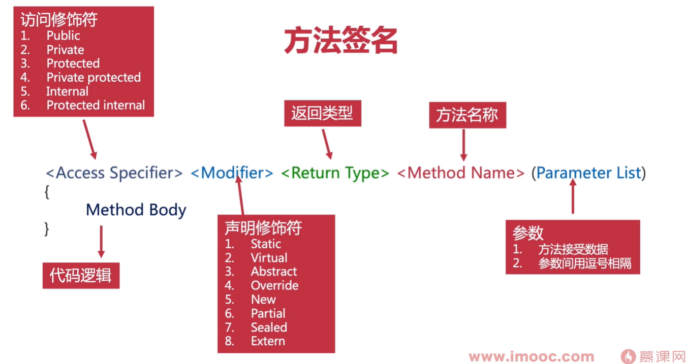
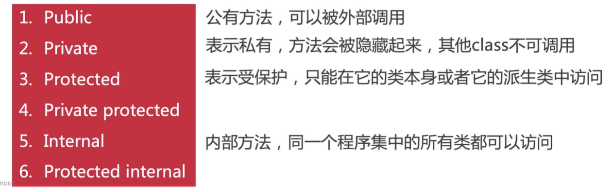
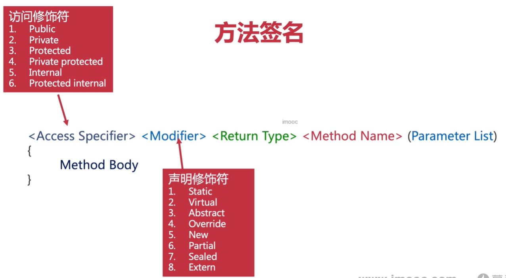
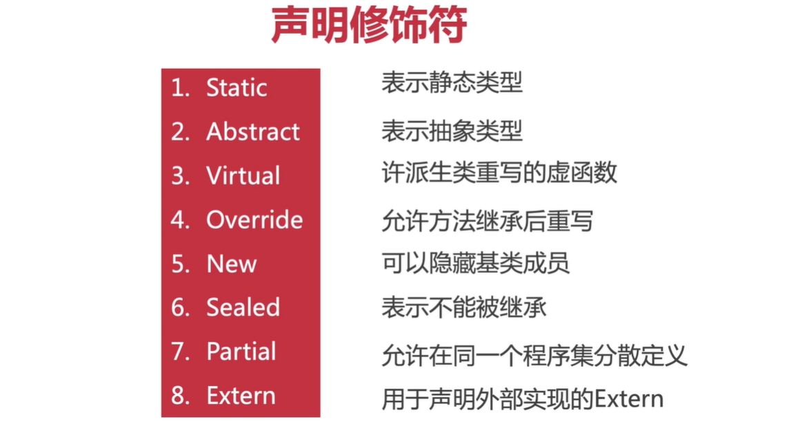
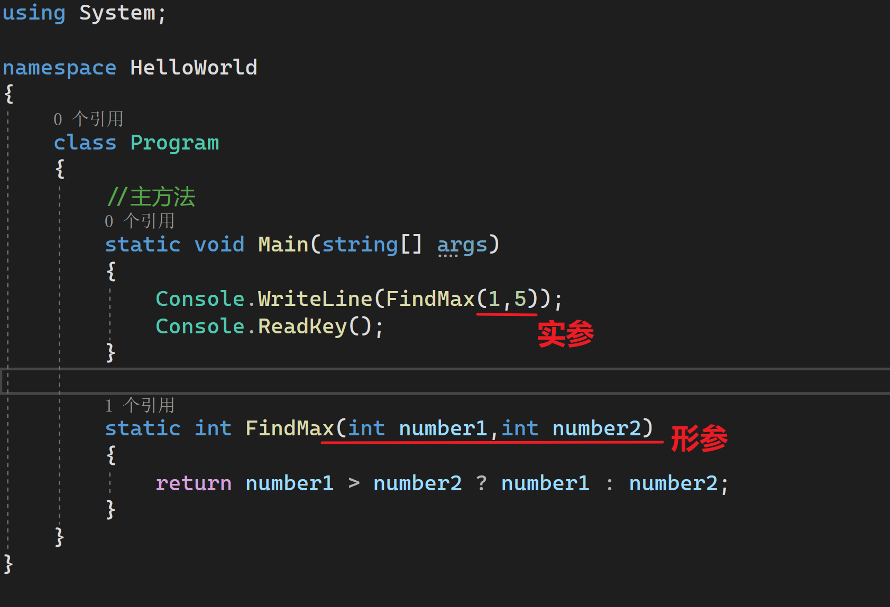
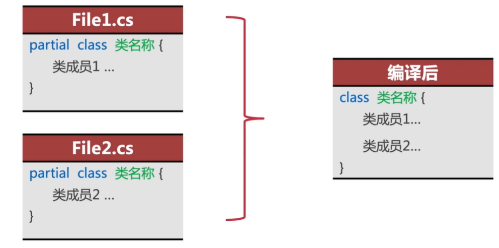
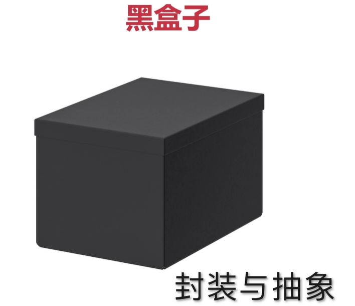

控制台IO System.Console

- Wirte()
- WirteLine()
- Read()
- ReadKey()
- ReadLine()
- Clear()

字符串方法与操作

```c#
using System;

namespace HelloWorld
{
    class Program
    {
        //主方法
        static void Main(string[] args)
        {
            string name = "龚东海";
            int age = 24;
            string s1 = "我是字符串";
            Console.WriteLine("你好，我叫{0}，今年{1}岁了。", name, age);

            //字符串格式化模板
            string s2 = "你好，我叫{0}，今年{1}岁了。";
            string output = string.Format(s2, name, age);
            Console.WriteLine(s2);

            //字符串内嵌
            Console.WriteLine($"你好，我叫{name},今年{age}岁了。");

            //原意字符串
            string s3 = @"
                        a{0}
                        b{1}
                        c
                        d";
            Console.WriteLine(s3);
            Console.WriteLine(string.Format(s3,name,age));
            Console.ReadKey();
        }
    }
}

```

## 方法

### 方法签名



#### 访问修饰符



#### 声明修饰符





### 形参和实参

形参，parameter，形式上的参数

实参，argument，真正调用方法过程中传入的具体数据



## 值传参 vs 引用传参 vs 输出传参

#### 值传参

参数传递的默认方式

为每个值参数创建一个新的存储位置

当形参的值发生改变时，不会影响实参的值，实参数据安全

例子：

下面我写了一个方法，目的是调换两个变量的数值。比如说a=10，b=20，调用了方法后，a=20，b=10。为什么调用之后，a和b的值还是照旧不变的，因为值传参时，不会影响实参的值，实参数据是安全的。

```c#
        static void swap(int x,int y)
        {
            int temp;
            temp = x;
            x = y;
            y = temp;
        }

        static void Main(string[] args)
        {
            int a = 10;
            int b = 20;
            swap(a, b);
            Console.WriteLine($"a = {a},b = {b}");//a=10,b=20
            Console.ReadKey();
        }
    }
```

#### ref

那么我就是要引用实参到方法中呢，那就得用`ref`了。请看下面代码。

```c#
        static void swap(ref int x, ref int y)
        {
            int temp;
            temp = x;
            x = y;
            y = temp;
        }

        static void Main(string[] args)
        {
            int a = 10;
            int b = 20;

            swap(ref a, ref b);
            Console.WriteLine($"a = {a},b = {b}");//a=20,b=10
            Console.ReadKey();
        }
```

#### ref VS out

共同点都是改变实参的数据。

不同点：

ref要提前定义、提前初始化、提前赋值，而使用out则没有限制。

## 面向对象

```c#
using System;

namespace HelloWorld
{
    class Program
    {
        public static void DrawPoint(Point point) => Console.WriteLine($"x为：{point.x}，y为：{point.y}");

        //主方法
        static void Main(string[] args)
        {
            Point a = new Point();
            a.x = 10;
            a.y = 30;
            DrawPoint(a);
            Console.ReadKey();
        }
    }
    public class Point
    {
        public int x;
        public int y;
    }
}

```


## 对象与内存管理

不管什么程序语言，内存的生命周期基本是一致的：

1. 分配内存
2. 使用内存（读写操作）
3. 用完后释放内存

### 内存分区

1. 栈区：由编译器自动分配释放 ，存放`值类型`的数据，引用类型(如对象)的`引用地址（指针）`，如静态区对象的引用地址（指针），常量区对象的引用地址（指针）等。而栈区操作方式顾名思义，类似于数据结构中的栈。
2. 堆区（托管堆）:用于存放`引用类型对象本身`，也就是对象数据。在c#中由.net平台的垃圾回收机制（GC）管理。栈，堆都属于动态存储区，可以实现动态分配。
3. 静态区及常量区：用于存`放静态类`，静态成员（静态变量，静态方法），`常量对象`。由于存在栈内的引用地址都在程序运行开始最先入栈，因此静态区和常量区内的对象的生命周期会持续到程序运行结束时，届时静态区内和常量区内对象才会被释放和回收（编译器自动释放）。所以应限制使用静态类，静态成员（静态变量，静态方法），常量，否则程序负荷高。
4. 代码区：存放函数体内的二进制代码。

注：不了解指针的同学，可以简单的把`指针`理解为指向某个内存区块的`内存地址`。

### 内存管理

类似于C这样的底层语言一般都有底层的内存管理方法，比如 分配malloc() 和释放free() 。

相反，C#是一种托管语言，它的垃圾回收机制（GC）是由.net平台负责的。在创建变量（对象，字符串等）的时候自动分配内存，并且在不再使用它们时候“自动”释放。 所以我们在使用过程中极少会考虑到内存使用状况以及项目在运行过程中是如何进行内存管理的。

与C++一样，C#内存也是分区、分类型管理的。

- 值类型：常见的`primitive type`，比如int char
- 引用类型：继承自`System.Object`，也就是对象，也包括String
- 指针类型：在内存区中，指向一个类型的引用，通常被称为`“指针”`（也就是内存地址），它是受CLR( Common Language Runtime:公共语言运行时)管理，我们不能显式使用。指针在内存中（栈区）占一块内存区，它本身只代表一个内存地址（或者null），它所指向的另一块内存区（堆区）才是我们真正的数据或者类型。

### 栈区管理

栈是编译期间就分配好的内存空间，因此你的代码中必须就栈的大小有明确的定义；

```c
Int n = 1;// 比如，使用Int声明类型其实就是在为变量n创建了一块大小为4个字节内存，并保存数字1的数据 00000000 00000000 00000000 00000001
```

栈区内存无需我们管理，也不受GC管理，栈顶元素使用完毕弹出就会立即释放。但是栈内存只能保存可以确定内存大小的数据，也就是只能保存值类型数据。

一个对象所占用的内存大小无法确定，所以不能保存在栈区，只能保存在堆区。

### 堆区管理

堆区是程序运行期间`动态分配`的内存空间，你可以根据程序的运行情况确定要分配的堆内存的大小。在C#中堆区内存由GC(Garbage collection:垃圾收集器)负责清理，当对象超出作用域范围或者对象失去指向的引用地址，就会在一定时间内进行统一的处理，无需程序员手动处理。

```c
User user1 = new User() { 
    age: 1,
    name: "alex"
};
// 声明初始化一个对象实例
// 1. 在堆区中创建了一块可以动态拓展大小的内存块，并把数据 "{ age: 1,name: "alex" }" 保存进去 
// 2. 在栈区创建了一个指向堆区的指针（也就是堆内存的引用地址），名称叫做user1.
```

在上面的例子中，当我们的程序使用user1的时候，其实使用的并不是数据 `{ age: 1,name: "alex" }`，而是一串指向它的`内存地址`。所以，我们在在使用user1的时候，实际上使用的是他的内存地址。

## 访问修饰符

### 5个常用访问修饰符

- **public**
- **private**
- **protected**
- **internal**
- **protected internal**


### 只读和只写

- 只读 read-only

```c#
访问修饰符 类型 属性{
	get{
		return _field;
	}
}
```

- 只写write-only

```c#
访问修饰符 类型 属性{
	get{
		_field = value;
	}
}
```

## 类索引(Index)的语法结构

```c#
        访问修饰符 声明修饰符 类型 this[参数]{
            get;
            set;
        }

        public string[] gamma = new string[]
            {
                "The",   // 顺：0，逆：9
                "quick", // 顺：1，逆：8
                "brown", // 顺：2，逆：7
                "fox",   // 顺：3，逆：6
                "jumped",// 顺：4，逆：5
                "over",  // 顺：5，逆：4
                "the",   // 顺：6，逆：3
                "lazy",  // 顺：7，逆：2
                "dog",   // 顺：8，逆：1
            };

        public string this[int index]
        {
            get
            {
                return gamma[index];
            }
            set
            {
                gamma[index] = value;
            }
        }
```

要点：

- 创建索引需要使用this关键词
- 索引可以用于快速访问一组数据的某一项
- 索引的使用需要通过方括号
- 索引不能用static，ref和out来修饰
- 索引可以被重载

## Partial Class 局部类



使用范围：

- 类型特别大，不适合放在同一个文件中实现；
- 自动生成的代码，不宜与我们自己编写的代码混合在一起；
- 一个类同时需要多个人同时编写的时候；

局限性：

- 只适用于类，接口，结构，不支持委托和枚举；
- 必须有修饰符partial；
- 必须同时编译；
- 必须位于相同的命名空间；
- 各部分的访问修饰符必须一致；
- 累加效应；

## 如何实现低耦合

- 封装，对业务逻辑实现细节的隐藏
- 类的关联性，依赖、关联、聚合、组合、泛化等
- 使用接口，OOP的思想核心，解决耦合的基本思路，重点中的重点

## 访问修饰符（protected与internal）




protected

只能被自己、或者被继承于自己的子类访问

internal

访问范围限定在一个项目内

## 向上转型与向下转型

向上转型（upcasting），把一个派生类类型转换为他的基类

向下转型（downcasting），是把一个基类转换为他的某个派生类

```c#
public class Shape{
	//comment
}

public class Circle : Shape{
	//comment
}

Circle circle = new Circle();
Shape shape = circle;//向上转型

Circle circle2 = (Circle)shape;//向下转型
```

